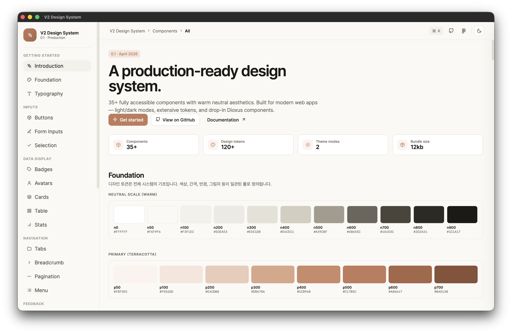

# V2 Design System



V2 Design System은 Dioxus를 더 빠르게 활용하기 위한 UI/UX 디자인 컴포넌트 시스템 모음집입니다.

이 프로젝트는 버튼, 입력 필드, 선택형 컨트롤, 데이터 표시, 모달, 드로어, 토스트 같은 공통 인터페이스 요소를 한곳에 모아 두고, Dioxus 환경에서 바로 가져다 쓸 수 있도록 구성한 디자인 시스템 쇼케이스이자 컴포넌트 라이브러리입니다.

## 목적

- Dioxus 기반 프로젝트에서 반복되는 UI 구현 비용을 줄입니다.
- 일관된 디자인 토큰과 컴포넌트 패턴을 빠르게 재사용할 수 있게 합니다.
- 화면별로 흩어져 있는 UI 요소를 컴포넌트 시스템 단위로 정리합니다.
- 디자인 검토, 포팅, 확장 작업을 위한 기준 화면을 제공합니다.

## 구성

- `src/`: Dioxus 기반 디자인 시스템 컴포넌트와 쇼케이스 화면
- `assets/`: 공통 스타일과 정적 리소스
- `Cargo.toml`: Rust 패키지 설정
- `Dioxus.toml`: Dioxus 애플리케이션 설정

## 실행

### Dioxus 데스크톱 실행

```bash
cargo run
```

### 확인용 체크

```bash
cargo check
```

## 라이선스

MIT License
